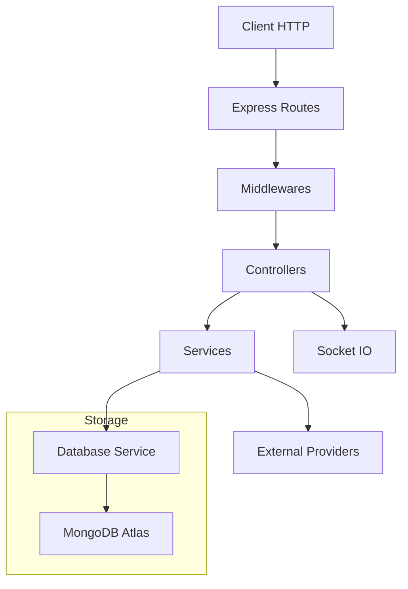

# TrellOne API — Architecture

## System overview

A layered, TypeScript Express backend with MongoDB Atlas and Socket.IO for real‑time collaboration. The core flow:

- HTTP client sends requests
- Express routes dispatch to middleware chains
- Validators authenticate, authorize, and validate inputs
- Controllers extract data and call services
- Services encapsulate business logic and database access
- Database service manages MongoDB connections and collections
- Socket.IO broadcasts real‑time events to rooms

Mermaid overview

## Source code paths

- App and server
  - [src/app.ts](src/app.ts)
  - [src/index.ts](src/index.ts)
- Configuration
  - [src/config/environment.ts](src/config/environment.ts)
  - [src/config/cors.ts](src/config/cors.ts)
  - [src/config/logger.ts](src/config/logger.ts)
- Constants
  - [src/constants/domains.ts](src/constants/domains.ts)
  - [src/constants/enums.ts](src/constants/enums.ts)
  - [src/constants/httpStatus.ts](src/constants/httpStatus.ts)
  - [src/constants/messages.ts](src/constants/messages.ts)
  - [src/constants/permissions.ts](src/constants/permissions.ts)
- Routes
  - [src/routes/auth.routes.ts](src/routes/auth.routes.ts)
  - [src/routes/users.routes.ts](src/routes/users.routes.ts)
  - [src/routes/workspaces.routes.ts](src/routes/workspaces.routes.ts)
  - [src/routes/boards.routes.ts](src/routes/boards.routes.ts)
  - [src/routes/columns.routes.ts](src/routes/columns.routes.ts)
  - [src/routes/cards.routes.ts](src/routes/cards.routes.ts)
  - [src/routes/medias.routes.ts](src/routes/medias.routes.ts)
  - [src/routes/invitations.routes.ts](src/routes/invitations.routes.ts)
- Middlewares
  - [src/middlewares/auth.middlewares.ts](src/middlewares/auth.middlewares.ts)
  - [src/middlewares/error.middlewares.ts](src/middlewares/error.middlewares.ts)
  - [src/middlewares/common.middlewares.ts](src/middlewares/common.middlewares.ts)
  - [src/middlewares/users.middlewares.ts](src/middlewares/users.middlewares.ts)
  - [src/middlewares/workspaces.middlewares.ts](src/middlewares/workspaces.middlewares.ts)
  - [src/middlewares/boards.middlewares.ts](src/middlewares/boards.middlewares.ts)
  - [src/middlewares/columns.middlewares.ts](src/middlewares/columns.middlewares.ts)
  - [src/middlewares/cards.middlewares.ts](src/middlewares/cards.middlewares.ts)
  - [src/middlewares/medias.middlewares.ts](src/middlewares/medias.middlewares.ts)
  - [src/middlewares/invitations.middlewares.ts](src/middlewares/invitations.middlewares.ts)
  - [src/middlewares/rbac.middlewares.ts](src/middlewares/rbac.middlewares.ts)
- Controllers
  - [src/controllers/auth.controllers.ts](src/controllers/auth.controllers.ts)
  - [src/controllers/users.controllers.ts](src/controllers/users.controllers.ts)
  - [src/controllers/workspaces.controllers.ts](src/controllers/workspaces.controllers.ts)
  - [src/controllers/boards.controllers.ts](src/controllers/boards.controllers.ts)
  - [src/controllers/columns.controllers.ts](src/controllers/columns.controllers.ts)
  - [src/controllers/cards.controllers.ts](src/controllers/cards.controllers.ts)
  - [src/controllers/invitations.controllers.ts](src/controllers/invitations.controllers.ts)
  - [src/controllers/medias.controllers.ts](src/controllers/medias.controllers.ts)
- Services
  - [src/services/database.services.ts](src/services/database.services.ts)
  - [src/services/auth.services.ts](src/services/auth.services.ts)
  - [src/services/users.services.ts](src/services/users.services.ts)
  - [src/services/workspaces.services.ts](src/services/workspaces.services.ts)
  - [src/services/boards.services.ts](src/services/boards.services.ts)
  - [src/services/columns.services.ts](src/services/columns.services.ts)
  - [src/services/cards.services.ts](src/services/cards.services.ts)
  - [src/services/invitations.services.ts](src/services/invitations.services.ts)
  - [src/services/medias.services.ts](src/services/medias.services.ts)
- Models
  - Schemas: [src/models/schemas](src/models/schemas)
  - Requests: [src/models/requests](src/models/requests)
  - Errors and extensions: [src/models/Errors.ts](src/models/Errors.ts), [src/models/Extensions.ts](src/models/Extensions.ts)
- Sockets
  - [src/sockets/workspaces.sockets.ts](src/sockets/workspaces.sockets.ts)
  - [src/sockets/boards.sockets.ts](src/sockets/boards.sockets.ts)
  - [src/sockets/cards.sockets.ts](src/sockets/cards.sockets.ts)
  - [src/sockets/invitations.sockets.ts](src/sockets/invitations.sockets.ts)
- Providers and templates
  - Providers: [src/providers/resend.ts](src/providers/resend.ts), [src/providers/uploadthing.ts](src/providers/uploadthing.ts), [src/providers/unsplash.ts](src/providers/unsplash.ts)
  - Templates: [src/templates](src/templates)
- Utilities
  - [src/utils/commons.ts](src/utils/commons.ts)
  - [src/utils/crypto.ts](src/utils/crypto.ts)
  - [src/utils/file.ts](src/utils/file.ts)
  - [src/utils/guards.ts](src/utils/guards.ts)
  - [src/utils/handlers.ts](src/utils/handlers.ts)
  - [src/utils/jwt.ts](src/utils/jwt.ts)
  - [src/utils/rbac.ts](src/utils/rbac.ts)
  - [src/utils/socket.ts](src/utils/socket.ts)
  - [src/utils/validation.ts](src/utils/validation.ts)

## Key technical decisions

- Layered architecture with strict downward dependency flow: routes → middlewares → controllers → services → database
- MongoDB Atlas with a centralized database service for connection and typed collections
- Soft delete pattern via `_destroy` across domain entities
- Role based permissions mapped to enum driven permission sets
- Socket.IO used for room scoped events per board and workspace
- Centralized request validation via express‑validator schemas and custom validators
- Centralized error handling through default error middleware and handler wrappers
- Environment specific configuration via `.env.NODE_ENV` files with early validation and process exit on misconfig
- CORS policy using whitelist plus permissive development mode

## Design patterns in use

- Singleton services exported as default instances
- Interface plus class schema pattern for MongoDB documents
- Middleware chain composition: authentication → resource validation → input validation → body filtering → controller
- Request body filter whitelist using generic filter middleware
- Constants driven messages and enums for type safety and consistency
- Token types and expirations configured via environment with ms based durations

## Component relationships

- Controllers depend on services only for business logic
- Services encapsulate all database access via [src/services/database.services.ts](src/services/database.services.ts)
- Middlewares attach validated resources and decoded tokens onto request for downstream access
- Socket utilities initialize and expose server wide Socket.IO instance from [src/utils/socket.ts](src/utils/socket.ts)
- Providers encapsulate third party interactions for email, files, and images

## Critical implementation paths

- Server startup: [src/index.ts](src/index.ts) → databaseService.connect() → app.listen(port) → socket initialization in [src/app.ts](src/app.ts)
- Auth flow: routes/auth → validators → controllers/auth.controllers.ts → services/auth.services.ts → jwt utils and cookie management
- Workspace and board access control: rbac middlewares, permissions from [src/constants/permissions.ts](src/constants/permissions.ts), membership checks in feature middlewares
- Moving cards and ordering: validators check column and board relationships, services manage atomic updates
- File uploads: media routes with validators → controllers → medias service → [src/utils/file.ts](src/utils/file.ts) and provider upload logic
- Real time events: sockets handlers in [src/sockets](src/sockets) publish updates to rooms keyed by board or workspace id

## Environments and deployment

- Node environment selection dictates `.env.NODE_ENV` file loaded by [src/config/environment.ts](src/config/environment.ts)
- Docker multi stage build produces production image and runs with PM2 using [ecosystem.config.js](ecosystem.config.js)
- Render deployment reference: [src/docs/DEPLOY_RENDER.md](src/docs/DEPLOY_RENDER.md)
