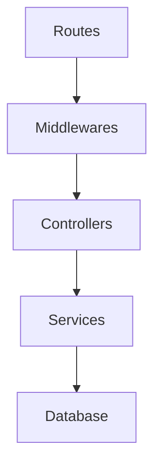

# TrellOne API - Architecture

## System Architecture

### Layered Architecture Pattern

TrellOne follows a strict layered architecture with clear separation of concerns:

```
Routes → Middlewares → Controllers → Services → Database
```

Each layer has specific responsibilities and dependencies flow downward only.

## Source Code Paths

### Directory Structure

```
src/
├── config/          # Application configuration
├── constants/       # Application constants and enums
├── controllers/     # Request handlers
├── middlewares/     # Request processing middleware
├── models/          # Data models and types
│   ├── schemas/     # Database schemas
│   └── requests/    # API request types
├── providers/       # External service integrations
├── routes/          # API route definitions
├── services/        # Business logic layer
├── sockets/         # Socket.IO event handlers
├── templates/       # Email templates
└── utils/           # Utility functions
```

### Layer Responsibilities

#### 1. Routes Layer (`src/routes/`)

- **Files**: `*.routes.ts` (e.g., `workspaces.routes.ts`, `boards.routes.ts`, `users.routes.ts`)
- **Purpose**: Define API endpoints and middleware chains
- **Pattern**: HTTP method routing with middleware orchestration

#### 2. Middlewares Layer (`src/middlewares/`)

- **Files**: `*.middlewares.ts` (e.g., `auth.middlewares.ts`, `workspaces.middlewares.ts`, `boards.middlewares.ts`)
- **Purpose**: Request preprocessing, validation, and authentication
- **Pattern**: Validation chains using express-validator

#### 3. Controllers Layer (`src/controllers/`)

- **Files**: `*.controllers.ts` (e.g., `workspaces.controllers.ts`, `boards.controllers.ts`, `users.controllers.ts`)
- **Purpose**: Request handling and business logic coordination
- **Pattern**: Extract → Service Call → Response formatting

#### 4. Services Layer (`src/services/`)

- **Files**: `*.services.ts` (e.g., `workspaces.services.ts`, `boards.services.ts`, `auth.services.ts`)
- **Purpose**: Business logic implementation and data access
- **Pattern**: Class-based services with singleton instances

#### 5. Database Layer (`src/services/database.services.ts`)

- **Purpose**: Database connection and collection management
- **Pattern**: Centralized database access with collection getters

## Key Technical Decisions

### 1. Database Schema Pattern

- **Dual Interface + Class Pattern**: Every schema has both TypeScript interface and class
- **Default Value Management**: Classes handle default values consistently
- **Soft Deletes**: `_destroy` flag instead of hard deletes

### 2. Authentication Strategy

- **JWT Tokens**: Access (15m) + Refresh (7d) tokens
- **Cookie + Header**: Priority-based token extraction
- **Socket Authentication**: Cookie-based for real-time connections

### 3. Real-time Architecture

- **Socket.IO**: Room-based communication for board isolation
- **Event Handlers**: Feature-specific socket handlers
- **Authentication Middleware**: Token verification for all socket events
- **Invitation Events**: Client emits `CLIENT_USER_INVITED_TO_BOARD`, server broadcasts `SERVER_USER_INVITED_TO_BOARD` to others (see sockets)

### 4. Hierarchical Organization

- **Workspace Management**: Enterprise-grade organizational structure
- **Role-based Access**: Admin/Normal roles across workspaces and boards
- **Data Hierarchy**: Workspaces → Boards → Columns → Cards

### 5. Role-Based Access Control (RBAC)

- **Granular Permissions**: Fine-grained permissions for workspaces and boards
- **Permission Inheritance**: Board roles can inherit from workspace roles
- **Explicit Overrides**: Board-level roles can override workspace-level roles
- **Middleware Integration**: RBAC checks integrated into route middleware chains
- **Implementation Details**:
  - RBAC middlewares implement permission guards for workspace, board, column, and card resources in [`requireWorkspacePermission()`](src/middlewares/rbac.middlewares.ts:22), [`requireBoardPermission()`](src/middlewares/rbac.middlewares.ts:57), [`requireColumnPermission()`](src/middlewares/rbac.middlewares.ts:143), [`requireCardPermission()`](src/middlewares/rbac.middlewares.ts:171) and body-based variants.
  - Permission catalogs and role mappings are defined in [`WorkspacePermission`](src/constants/permissions.ts:3), [`BoardPermission`](src/constants/permissions.ts:13), [`WORKSPACE_ROLE_PERMISSIONS`](src/constants/permissions.ts:27), [`BOARD_ROLE_PERMISSIONS`](src/constants/permissions.ts:44).
  - Effective role resolution and permission checks are centralized in [`resolveEffectiveBoardRole()`](src/utils/rbac.ts:33), [`hasWorkspacePermission()`](src/utils/rbac.ts:64), and [`hasBoardPermission()`](src/utils/rbac.ts:76).
  - Inheritance and overrides:
    - If a user has an explicit board role, it is respected when `RESPECT_BOARD_EXPLICIT_OVERRIDES = true` (default).
    - If no explicit board role, workspace role is mapped to a board role (Admin → Admin, Normal → Member).
    - Guests or non-members have no permissions unless explicitly granted at board level.

## Design Patterns

### 1. Service Layer Pattern

```typescript
class ServiceName {
  private signAccessToken() {} // Private utilities
  async createResource() {} // Public business logic
}
const serviceName = new ServiceName()
export default serviceName
```

### 2. Repository Pattern (via Database Service)

```typescript
class DatabaseService {
  get users(): Collection<User> {}
  get workspaces(): Collection<Workspace> {}
  get boards(): Collection<Board> {}
}
```

### 3. Factory Pattern (Schema Creation)

```typescript
interface UserSchema {
  email: string
  password: string
}
export default class User {
  constructor(user: UserSchema) {
    this.email = user.email
    this.created_at = new Date()
  }
}
```

### 4. Middleware Chain Pattern

```typescript
router.put(
  '/:id',
  accessTokenValidator, // Authentication
  resourceIdValidator, // Resource validation
  updateValidator, // Input validation
  filterMiddleware(['field1']), // Body filtering
  wrapRequestHandler(controller) // Controller
)
```

### 5. RBAC Middleware Pattern

```typescript
router.put(
  '/:workspace_id',
  accessTokenValidator,
  verifiedUserValidator,
  workspaceIdValidator,
  updateWorkspaceValidator,
  filterMiddleware<UpdateWorkspaceReqBody>(['title', 'description', 'type', 'logo']),
  requireWorkspacePermission(WorkspacePermission.ManageWorkspace), // RBAC check
  wrapRequestHandler(updateWorkspaceController)
)
```

## Component Relationships

### 1. Authentication Flow

```
Request → Extract Token → Verify JWT → Attach User → Proceed
```

### 2. Database Operations

```
Controller → Service → Database Service → MongoDB Collection
```

### 3. Real-time Communication

```
Client Event → Socket Handler → Service → Database → Broadcast
```

### 4. File Upload Pipeline

```
Upload → Temp Storage → Sharp Processing → UploadThing → Cleanup
```

### 5. Hierarchical Data Flow

```
Workspace Operation → Board Impact → Column Impact → Card Impact
```

### 6. RBAC Permission Flow

```
Request → Authentication → Resource Validation → RBAC Check → Controller
```

## Critical Implementation Paths

### 1. User Registration Flow

```
POST /auth/register → registerValidator → registerController →
authService.register() → User.schema → database.users.insertOne() →
sendVerifyEmail() → JWT generation → Cookie setting →
Auto-create workspace
```

### 2. Workspace Creation Flow

```
POST /workspaces → accessTokenValidator → verifiedUserValidator →
createWorkspaceValidator → createWorkspaceController →
workspacesService.createWorkspace() → Workspace.schema →
database.workspaces.insertOne() → Response
```

### 3. Board Creation Flow

```
POST /boards → accessTokenValidator → verifiedUserValidator →
createBoardValidator → createBoardController →
boardsService.createBoard() → Board.schema →
database.boards.insertOne() → Update workspace → Response
```

### 4. Card Management Flow

```
POST /cards → accessTokenValidator → verifiedUserValidator →
cardIdValidator → createCardValidator → createCardController →
cardsService.createCard() → Card.schema →
database.cards.insertOne() → Update column → Socket broadcast
```

### 5. Card Deletion Flow

```
DELETE /cards/:card_id → accessTokenValidator → verifiedUserValidator →
cardIdValidator → deleteCardController →
cardsService.deleteCard() → Remove from database →
Update column card_order_ids → Socket broadcast
```

### 6. Board Collaboration Flow

```
Socket Connection → Authentication → Room Join →
Board Update Event → boardsService.updateBoard() →
Database Update → Broadcast to Room
```

### 7. Card Movement Flow

```
PUT /cards/supports/moving-card → Authentication → Validation →
cardsService.moveCardToDifferentColumn() → Multi-collection Updates →
Socket Broadcast → Real-time UI Updates
```

### 8. File Upload Flow

```
POST /medias/upload-image → Authentication → File Validation →
Temporary Storage → Sharp Processing → UploadThing Upload →
Database Storage → Cleanup → Response
```

### 9. Workspace Member Management Flow

```
Workspace Access → workspaceIdValidator → MongoDB Aggregation →
Member lookup → User details join → Permission validation →
Attach to request → Controller access
```

### 10. Comment Reaction Flow

```
PUT /cards/:card_id → Authentication → Validation →
cardsService.reactCardComment() → MongoDB positional update →
Reaction management → Socket broadcast → Real-time updates
```

### 11. RBAC Permission Check Flow

```
Route Access → Authentication → Resource Validation →
RBAC Middleware → Permission Check → Controller
```

### 12. Invitation Flows

```
// Workspace Invitation Creation
POST /invitations/workspace → Authentication → verifiedUserValidator →
createNewWorkspaceInvitationValidator → verifyInviteeMembershipValidator →
invitationsService.createNewWorkspaceInvitation() → Email send (workspace-invitation) → Response
```

```
// Board Invitation Creation
POST /invitations/board → Authentication → verifiedUserValidator →
createNewBoardInvitationValidator → verifyInviteeMembershipValidator →
invitationsService.createNewBoardInvitation() → Email send (board-invitation) → Response
```

```
// Invitation Verification
POST /invitations/verify-invitation → Authentication → verifiedUserValidator →
verifyInviteTokenValidator → verifyInvitationController → Response
```

```
// Invitation Status Update
PUT /invitations/workspace/:invitation_id → Authentication → invitationIdValidator →
updateWorkspaceInvitationValidator → workspaceInvitationUpdateGuard →
invitationsService.updateWorkspaceInvitation() → Response
```

```
// Invitation Status Update
PUT /invitations/board/:invitation_id → Authentication → invitationIdValidator →
updateBoardInvitationValidator → boardInvitationUpdateGuard →
invitationsService.updateBoardInvitation() → Response
```

## Error Handling Architecture

### 1. Centralized Error Handler

```typescript
export const defaultErrorHandler = (err: any, req: Request, res: Response, next: NextFunction) => {
  if (err instanceof ErrorWithStatus) {
    return res.status(err.status).json(omit(err, ['status']))
  }
  // Handle other errors...
}
```

### 2. Custom Error Classes

```typescript
export class ErrorWithStatus extends Error {
  status: number
  constructor({ message, status }: { message: string; status: number }) {
    super(message)
    this.status = status
  }
}
```

## Performance Optimization

### 1. Database Patterns

- **Aggregation Pipelines**: Complex queries with MongoDB aggregation
- **Parallel Operations**: Promise.all for independent operations
- **Connection Pooling**: Single connection instance with driver pooling

### 2. Real-time Optimization

- **Room-based Communication**: Targeted message broadcasting
- **Event Batching**: Efficient socket event handling
- **Connection Management**: Proper cleanup and session tracking

## Security Architecture

### 1. Input Validation

- **express-validator**: Schema-based validation for all endpoints
- **Custom Validators**: Business logic validation in middleware
- **File Upload Security**: MIME type and size validation

### 2. Authentication Security

- **JWT Signing**: Separate secrets for different token types
- **Password Hashing**: Salt + SHA256 for password security
- **CORS Configuration**: Environment-based origin control

### 3. Role-based Access Control

- **Workspace Roles**: Admin/Normal permissions within workspaces
- **Board Access**: Workspace membership determines board access
- **Resource Authorization**: Middleware validates user permissions
- **Granular Permissions**: Fine-grained control over actions

### 4. RBAC Security

- **Permission-based Access**: Actions require specific permissions
- **Inheritance Model**: Roles inherit permissions from parent roles
- **Explicit Overrides**: Fine-grained control at resource level

## External Service Integration

### 1. Provider Pattern

- **Resend**: Email service integration
- **UploadThing**: File upload service
- **Unsplash**: Image service for cover photos

### 2. Service Abstraction

```typescript
export const sendVerifyRegisterEmail = async (email: string, token: string) => {
  // Abstract external service complexity
}
```

## Diagrams



````mermaid
flowchart TD
  S[Request] --> A[Extract user_id]
  A --> B[Get explicit board role]
  B --> C[Workspace role if no explicit]
  C --> D[Resolve effective role]
  D --> E[Check role permissions]
  E --> F{Allow or Deny}
```Possible matches are (insert at a position where the aging child’s baseline is better than all other children in the g)
  print_and_log(f"Generating pair using aging child solved issue: {baseline} -> {issue_idx}")
  return pair_baseline, pair_issue_idx, reduction_reason


def resolve_issue_pair_a(
    param_search,
    child_missing_effective_baseline,
    child_one_effective_item_idxs,
    child_two_effective_item_idxs,
    checkpoint_seq_0,
    one_missing,
    two_missing,
    latest_behavior,
    debugging=False):
  """Alternative approach to resolve issue pairs.

  This approach is used instead of _resolve_issue_pair when the two checkpoint algae have the same expected rank despite one being regenerated from scratch from the cheapest tag instead of from two parents.
  """
  print_and_log(f"(1) RESOLVING")
  (one_effective_item_idxs,
   one_recompute_idxs,
   one_baseline,
   one_issue_str,
   one_baseline,
  ) = generate_optimal_solution(
    child_missing_effective_baseline,
    child_one_effective_item_idxs,
    child_two_effective_item_idxs,
    checkpoint_seq_0,
    one_missing,
    two_missing,
    latest_behavior,
    debugging,
  )
  print_and_log(f"(2) ONE: {one_baseline} == {child_missing_effective_baseline}, {one_issue_str}, {len(one_one_missing_idxs)} to re-compute")
  if one_baseline < child_missing_effective_baseline:
    print_and_log("   one good!")
  while one_baseline == child_missing_effective_baseline:
    if len(one_recompute_idxs) > 1:
      recompute_idx = choose_best_recompute_idx(one_recompute_idxs)
      param_search.recompute_if(error, checkpoint_seq_0, recompute_idx)
      if debugging and params is not None:
        params.evaluate_checkpoint()
    else:
      break
    (one_effective_item_idxs,
     one_recompute_idxs,
     one_baseline,
     one_issue_str,
     one_baseline,
    ) = generate_optimal_solution(
      child_missing_effective_baseline,
      child_one_effective_item_idxs,
      child_two_effective_item_idxs,
      checkpoint_seq_0,
      one_missing,
      two_missing,
      latest_behavior,
      debugging,
    )
    print_and_log(f"(2) ONE: {one_baseline} == {child_missing_effective_baseline}, {one_issue_str}, {len(one_recompute_idxs)} to re-compute")

  print_and_log(f"(3) RESOLVING")
  (two_effective_item_idxs,
   two_recompute_idxs,
   two_baseline,
   two_issue_str,
   two_baseline,
  ) = generate_optimal_solution(
    one_baseline,
    child_two_effective_item_idxs,
    child_one_effective_item_idxs,
    checkpoint_seq_0,
    two_missing,
    one_missing,
    latest_behavior,
    debugging,
  )
  print_and_log(f"(4) TWO: {two_baseline} == {one_baseline}, {two_issue_str}, {len(two_recompute_idxs)} to re-compute")
  if two_baseline > one_baseline:
    print_and_log("   two good!")
  while two_baseline == one_baseline:
    if len(two_recompute_idxs) > 1:
      recompute_idx = choose_best_recompute_idx(two_recompute_idxs)
      param_search.recompute_if(error, checkpoint_seq_0, recompute_idx)
      if debugging and params is not None:
        params.evaluate_checkpoint()
    else:
      break
    (two_effective_item_idxs,
     two_recompute_idxs,
     two_baseline,
     two_issue_str,
     two_baseline,
    ) = generate_optimal_solution(
      one_baseline,
      child_two_effective_item_idxs,
      child_one_effective_item_idxs,
      checkpoint_seq_0,
      two_missing,
      one_missing,
      latest_behavior,
      debugging,
    )
    print_and_log(f"(4) TWO: {two_baseline} == {one_baseline}, {two_issue_str}, {len(two_recompute_idxs)} to re-compute")
  print_and_log(f"(5) OPTIMAL: {two_baseline} == {one_baseline} < {child_missing_effective_baseline}")
  return one_baseline, two_baseline
# In scenario 2, we have a conflicting issue pair that converges to two different optimal algorithms at the start of the cycle, but with a worse overall solution.
  def reconcile_issue(
    checkpoint_seq_0,
    checkpoint_seq_1,
    graph,
    latest_behavior,
    recursion_depth,
    policy_alternating=False,
    debugging=False,
  ):
    # print(
    strategy, child_one_issue_str, child_two_issue_str = self._get_backtracking_strategy(
      checkpoint_seq_0, checkpoint_seq_1, graph
    )
    print_and_log(
      f"     new (new) problem: {self._map_strategy_to_key(strategy)}; {child_one_issue_str}{checkpoint_seq_0.xlat() if child_one_issue_str else ''}, {child_two_issue_str}{checkpoint_seq_1.xlat() if child_two_issue_str else ''}"
    )
    if child_one_issue_str is not None:
      policy_alternating = self._check_if_stuck_and_update_policy(
        graph=graph,
        checkpoint_seq=checkpoint_seq_0,
        latest_behavior=latest_behavior,
        recuursion_depth=recursion_depth,
        policy_alternating=policy_alternating,
        debugging=debugging,
      )
    if child_two_issue_str is not None:
      policy_alternating = self._check_if_stuck_and_update_policy(
        graph=graph,
        checkpoint_seq=checkpoint_seq_1,
        latest_behavior=latest_behavior,
        recursion_depth=recursion_depth,
        policy_alternating=policy_alternating,
        debugging=debugging,
      )
    return self._resolve_issue_pair(
      strategy=strategy,
      checkpoints_vec=checkpoints_vec,
      tracking_key_tracking_key_no_overlap_avg_seeing_issue,
      previous_optimal_value,  # actual_best_value
      absolute_optimal_value,  # actual_best_value
      graph=graph,
      latest_behavior=latest_behavior,
      policy_alternating=policy_alternating,
    )
  @_timeit
  def _get_backtracking_strategy(
    self,
    checkpoint_seq_0: CheckpointSequence,
    checkpoint_seq_1: CheckpointSequence,
    graph,
  ) -> StrategyTuple:
    # Handle first-backtracking conflict
    # if strategy is NONE or RANDOM: consult last_best_pair to decide what backtracking strategy to use
    last_best_pair = self._get_last_record(graph)
    child_0 = graph.last_checkpoint(checkpoints_a=checkpoint_seq_0.checkpoints_a)
    child_1 = graph.last_checkpoint(checkpoints_a=checkpoint_seq_1.checkpoints_a)
    if last_best_pair is not None:  # if last_best_pair is not None, algorithm==NONE and we are in scenario 2
      reassessment = check_point_seq(diff=True).has_checkpoints(
        a_unknown=child_0.checkpoint_a.is_unknown,
        b_unknown=child_0.checkpoint_b.is_unknown,
        a_idx_concurrent=child_0.missing_answer_idx is not None
        and child_0.missing_answer_idx == child_0.checkpoint_a.missing_index,
        b_idx_concurrent=child_0.missing_answer_idx is not None
        and child_0.missing_answer_idx == child_0.checkpoint_b.missing_index,
        a_answer_concurrent=last_best_pair.child_one_answer_diff == last_best_pair.child_one_answer_diff,
        b_answer_concurrent=last_best_pair.child_one_answer_diff == last_best_pair.child_one_answer_diff
      )
      if reassessment:
        # Strategy is based on last_best_pair,idx
        strategy = self._map_backtracking_strategy(
          a_idx_success=getattr(child_0, missing_answer_idx),
          b_idx_success=getattr(child_1, missing_answer_idx),
          a_answer_success=last_best_pair,
          b_answer_success=last_best_pair,
        )
      else:
        strategy = Strategy.NONE
    else:
      strategy = self.strategy()

    # Handle second-backtracking conflict (instead of testing concurrently test on only one allele at a time as suggested)
    child_two_strategy_instance = None
    child_two_issue_str = None
    (strategy,
     child_one_issue_str,
     child_one_strategy_instance) = self._map_strategy_to_key(strategy)
    if child_two_strategy_instance is not None:
      child_two_issue_str = (
        ", " + str(child_two_strategy_instance) if isinstance(child_two_strategy_instance, Tag) else ", " + child_two_strategy_instance.name
      )

    return Strategy(strategy), child_one_issue_str, child_two_issue_str

  def _check_if_stuck_and_update_policy(
    self,
    graph,
    checkpoint_seq,
    latest_behavior,
    recursion_depth,
    policy_alternating,
    debugging,
  ) -> bool:
    # Check if we have seen evidence of stuck-ness and, if so, adjust our policy accordingly
    checkpoint = graph.last_checkpoint(checkpoints_a=checkpoint_seq.checkpoints_a)
    if checkpoint is None:
      self._check_if_stuck_and_update_policy_impl(
        checkpoint_seq=checkpoint_seq,
        latest_behavior=latest_behavior,
        recursion_depth=recursion_depth,
        policy_alternating=policy_alternating,
        debugging=debugging,
      )
    return policy_alternating

  def _check_if_stuck_and_update_policy_impl(
    self,
    checkpoint_seq,
    latest_behavior,
    recursion_depth,
    policy_alternating,
    debugging,
  ):
    """This method-refreshes the strategy for the session without actually doing anything about the stuck-ness yet"""
    latest_behavior.latest_caurence_idx = checkpoint_seq.checkpoints_a[-1].tag

    # Refreshes the strategy for the session.
    if (
      self.stuck_on_different_issues_recurosion_depth_limit
      is not None
      and self.stuck_on_different_issues_recurosion_depth_limit > 0
      and recursion_depth >= self.stuck_on_different_issues_recurosion_depth_limit
    ):
      print_and_log(" --> Stuck on same issue, try switching to CUMULATIVE")
      # Logger.warning(f" **RE-EVALUATING STRATEGY TO CUMULATIVE** after {recursion_depth}/{STUCK_ON_DIFFERENT_ISSUES_NUMBER_OF_RECURSIONS_LIMIT} recusions") # type: ignore
      strategy1 = latest_behavior.strategy
      strategy2 = Strategy.CUMULATIVE
      self.best_pair_tracker.handle_strategy_agents(strategy1, strategy2)
      print_and_log(
        f"=>SWITCHING FROM {repr(strategy1)} to [{repr(strategy2)}",
      )

    elif policy_alternating:
      if debugging and self.function_call_measuring and params is not None:
        params.tracker_algorithm_executed_cycles.counter += 1
      strategy = latest_behavior.current_strategy
      if strategy == Strategy.CUMULATIVE:
        strategy1 = Strategy.DERIVED
        strategy2 = Strategy.ALTERNATING
      elif strategy == Strategy.DERIVED:
        strategy1 = Strategy.CUMULATIVE
        strategy2 = Strategy.ALTERNATING
      elif strategy == Strategy.ALTERNATING:
        strategy1 = Strategy.CUMULATIVE
        strategy2 = Strategy.DERIVED
      else:
        strategy1 = strategy
        strategy2 = strategy

      self.best_pair_tracker.handle_strategy_agents(strategy1, strategy2)
      print_and_log(f"=>SWITCHING FROM {repr(strategy1)} to [{repr(strategy2)}] [RECURSION_LEVEL: {recursion_depth}]")

  def _map_strategy_to_key(
    self,
    strategy: Strategy,
  ) -> StrategyTuple:
    """Returns a tuple:

    (best_pair_target_strategy, child_one_issue_str, child_two_issue_str), where child_two_issue_str=None if the framework does not apply

    This method allows direct mapping from Strategy enum to human-readable "child issue" understanding
    """
    if strategy == Strategy.BETTER:
      return (
        Strategy.BETTER,
        None,
        None,
      )
    if strategy == Strategy.MERGE:
      return (
        Strategy.MERGE,
        None,
        None,
      )
    if strategy == Strategy.DIRECT:
      return (
        Strategy.DIRECT,
        None,
        None,
      )
    if strategy == Strategy.ALT:
      return (
        Strategy.ALT,
        Tag.ALTERNATING,
        None,
      )
    if strategy == Strategy.DERIVED:
      return (
        Strategy.DERIVED,
        Tag.DERIVED,
        None,
      )
    if strategy == Strategy.CUMULATIVE:
      (ensure_type(str, Tag.CUMULATIVE), "child_two_str")
    )

    # if bDelta == 0, the difference between the costs of this checkpoint and the previous is zero, so one answer wasn't better
    if bDelta > e:  # if one cost was bigger, and that one wans a benefit, ba side will have some cost benefit
      if bDelta > aDelta == 0 and bCostBenefit > 0:  # if b won, it was because of one answer changing to be more optimal
        return Tag.ALTERNATING  # b as a solution is a benefit of the greater impact from a change
      # otherwise, if one answer is a cost-benefit, a side will have some cost benefit
      return Tag.DERIVED  # a as a solution is a benefit of the greater impact from b change
    else:
      if aDelta == 0 and aCostBenefit > 0:
        return Tag.DERIVED
      else:
        return Tag.ALTERNATING

    assert False

  def _get_tags_to_decode(
    self, strategy
  ) -> List[Type[Tag]]:
    return []

  def _compare_strategies(
    self,
    graph,
    latest_behavior,
    checkpoint_seq_0: CheckpointSequence,
    checkpoint_seq_1: CheckpointSequence,
    period
  ) -> bool:
    checkpoint_0 = graph.last_checkpoint(checkpoints_a=checkpoint_seq_0.checkpoints_a)
    checkpoint_1 = graph.last_checkpoint(checkpoints_a=checkpoint_seq_1.checkpoints_a)
    checkpoint = graph.last_checkpoint(checkpoints_a=checkpoint_seq_1.checkpoints_a)
    child_1 = checkpoint_1 if checkpoint_0 is None else checkpoint
    if checkpoint is not None:
      if checkpoint.is_unknown:
        value = checkpoint.estimated_reduction
      else:
        value = checkpoint.reduction
      if self._get_tags_to_decode(latest_behavior.current_strategy):
        period(temporary_decrement, latest_behavior.encourage_tags_once_per_n_cycles_exponent)
        if type == EVALUATION_TYPE_DECREASING:
          self._get_tags_to_decode(latest_behavior.current_strategy).remove(tag)
      elif type == EVALUATION_TYPE_INCREASE:
        period(temporary_encrement, latest_behavior.encourage_tags_once_per_n_cycles_exponent)
        if tag not in self._get_tags_to_decode(latest_behavior.current_strategy):
          self._get_tags_to_decode(latest_behavior.current_strategy).append(tag)

    return value

  def is_st(double v):
    """Make sure Java 7 is compatible when using bytecode compiled by Java 8"""
    return float.is_finite(v)

  def _set_temporary_increment_or_decrement(
    self,
    latest_behavior,
    tag: Tag,
    type,
    value,
  ):
    """Easy way for positive value to be applied for INCREASE and negative applied fo DECREASING"""
    latest_behavior.temporary_increment[tag()] = value if type == EVALUATION_TYPE_INCREASE else -value
    latest_behavior.temporary_decrement[tag()] = value if type == EVALUATION_TYPE_INCREASING else -value


def serialize_child_solutions(child_solution_id_count_pairs: Dict[SolutionCheckerFunctionId, IdCountPair]) -> str:  # noqa: F722
  """Formats a dict of child solutions as human readable string"""
  if not child_solution_id_count_pairs:
    return "N/A"

  # See: line 3655 for opposite operation
  return "\n".join([f"{solution_checker_func_id.value}:{pair.solution_id + 1}" for solution_checker_func_id, pair in child_solution_id_count_pairs.items()])  # noqa: F405


def _already_shown(optimization_run_details: OptimizationRunDetails) -> bool:
  optimization_run_id = getattr(OPTIMIZATION, "CURRENT_KEY_ID", -1)
  return (
    optimization_run_details.last_run_used_details is not None
    and optimization_run_details.last_run_used_details.optimization_run_id == optimization_run_id
  )


def _choose_between_pair_different_whole_algorithms(child_one_result, child_two_result) -> Sequence[int]:
  worst_reproducing_answer_idx = child_one_result.attr.get("answer_idx")
  if child_one_result.is_provider_best:
    child_one = child_one_result
    child_two = child_two_result
  else:
    child_two = child_one_result
    child_one = child_two_result
  child_selection = child_one.selection
  possible_explored_algorithms = sorted(
    _bundle_items(
      child_one.solutions_tracker.list_all_explored_algorithms(),
      child_two.solutions_tracker.list_all_explored_algorithms()
    )
    symmetric_search_dim = get_unique_tag_dims(
      possible_explored_algorithms,
      execute_until_solved=(len(possible_explored_algorithms) == 1),
      counts_one_allo=(len(possible_explored_algorithms) == 2)
    )[0]
  )

  answer_diffs = list(symmetric_search_dim.first_item_combinations_options_dict.keys())
  if len(answer_diffs) == 1:
    should_optimize_answer_1 = should_optimize_tagged_child(worst_reproducing_answer_idx, child_one.tag, answer_diffs[0])
  else:
    should_optimize_answer_1 = should_optimize_tagged_child(worst_reproducing_answer_idx, child_one.tag)
  if should_optimize_answer_1:
    return child_selection
  else:
    return child_two.selection
````
